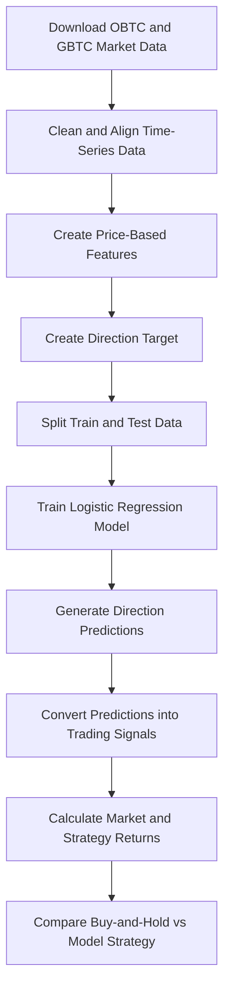

# ML Stock Prediction: OBTC Intraday Direction Forecasting


A machine learning project for predicting short-term price direction of **Osprey Bitcoin Trust (OBTC)** using intraday market data, financial feature engineering, and a Logistic Regression-based trading signal workflow.

This project is designed as a practical financial machine learning pipeline. It starts from market data collection, continues through time-series preprocessing and feature engineering, then trains a classification model and converts predictions into simple trading signals for return comparison.

---

## Project Objective

Financial market data is noisy and difficult to predict using exact price forecasting. Instead of trying to predict the next price directly, this project focuses on a more practical question:

> Can machine learning predict whether the next OBTC closing price will move upward or not?

The problem is framed as a **binary classification task**, where the model predicts the next-period price direction based on recent OBTC price behavior and related GBTC market movement.

This project is not intended to be a production trading bot. It is a portfolio-style machine learning project that demonstrates the full workflow of financial data analysis, model building, and basic strategy evaluation.

---

## Core Idea

The model uses historical intraday market data to create features that describe short-term price behavior. These features are then used to train a Logistic Regression classifier.

The prediction output is converted into a simple trading signal:

- Predict upward movement: hold a long position
- Predict downward or non-upward movement: avoid or reduce exposure

The strategy return is then compared against a basic buy-and-hold return to evaluate whether the model signal provides useful directional information.

---

## Data Sources

Market data is collected using the `yfinance` Python library.

| Asset | Description | Role in Project |
|---|---|---|
| OBTC | Osprey Bitcoin Trust | Main prediction target |
| GBTC | Grayscale Bitcoin Trust | Related-market feature source |

The dataset uses intraday OHLC price data, including open, high, low, and close prices.

---

## Target Definition

The target variable is created from the next-period OBTC closing price.

```text
1  = next closing price is higher than the current closing price
-1 = next closing price is lower than or equal to the current closing price
```

This converts the task from price prediction into direction classification.

---

## Machine Learning Workflow



---

## Feature Engineering

The project combines raw market variables and engineered features to capture price behavior, short-term momentum, and cross-asset relationship.

| Feature | Description |
|---|---|
| `Open` | OBTC opening price |
| `High` | OBTC highest price during the period |
| `Low` | OBTC lowest price during the period |
| `Close` | OBTC closing price |
| `GBTC_Open` | GBTC opening price |
| `GBTC_Close` | GBTC closing price |
| `S_10` | Short-term rolling price statistic |
| `Corr` | Rolling relationship feature between OBTC and GBTC |
| `Open-Close` | Difference between opening and closing price |
| `Open-Open` | Change in opening price between periods |

These features help the model learn from recent price movement rather than relying only on the current closing price.

---

## Model

The project uses **Logistic Regression** as the baseline classification model.

Logistic Regression was selected because it is:

- Fast to train
- Easy to interpret
- Suitable for binary classification
- Useful as a baseline for financial ML experiments
- More explainable than many black-box models

The model predicts whether the next-period OBTC close is likely to move upward or not.

---

## Backtesting Concept

After prediction, the model output is transformed into a simple strategy signal. The notebook compares two return paths:

| Return Type | Description |
|---|---|
| Buy-and-Hold Return | Holding OBTC through the test period |
| Strategy Return | Return generated from model-based directional signals |

This provides a simple way to evaluate whether the machine learning signal adds value compared with passive holding.

The current backtest is intentionally lightweight. It does not yet include transaction costs, slippage, liquidity constraints, position sizing, or advanced risk management.

---

## Repository Structure

```text
ML-stock-prediction/
├── README.md
├── requirements.txt
├── obtc_direction_prediction.ipynb
├── ML_LogisticRegression.ipynb
└── archive/
    └── previous notebook iterations
```

| File / Folder | Purpose |
|---|---|
| `obtc_direction_prediction.ipynb` | Main notebook for OBTC direction prediction, signal generation, and return comparison |
| `ML_LogisticRegression.ipynb` | Supporting notebook for Logistic Regression modeling workflow |
| `requirements.txt` | Python dependencies required to run the project |
| `archive/` | Previous notebook iterations kept for development history |

---

## Tech Stack

| Category | Tools |
|---|---|
| Programming Language | Python |
| Data Collection | yfinance |
| Data Processing | pandas, numpy |
| Machine Learning | scikit-learn |
| Visualization | matplotlib, seaborn, plotly |
| Environment | Jupyter Notebook / Google Colab |

---

## How to Run

### 1. Clone the Repository

```bash
git clone https://github.com/KunakornMart/ML-stock-prediction.git
cd ML-stock-prediction
```

### 2. Install Dependencies

```bash
pip install -r requirements.txt
```

### 3. Open Jupyter Notebook

```bash
jupyter notebook
```

Then open:

```text
obtc_direction_prediction.ipynb
```

The notebook can also be opened and run in Google Colab.

---

## What This Project Demonstrates

This project demonstrates practical skills in:

- Financial data collection from external APIs
- Intraday time-series data preparation
- Feature engineering from OHLC market data
- Cross-asset feature creation using related market instruments
- Binary classification with scikit-learn
- Logistic Regression modeling
- Trading signal generation
- Simple strategy backtesting
- Return comparison and visualization
- Notebook-based machine learning experimentation

---

## Limitations

This project is an experimental financial machine learning prototype. Current limitations include:

- The model uses a simple train/test split
- Transaction costs and slippage are not included
- Market regime shifts are not explicitly modeled
- Logistic Regression may not capture complex nonlinear market behavior
- The strategy logic is simplified
- Results may vary depending on data period and market conditions

These limitations create clear opportunities for future improvement.

---

## Future Improvements

Potential next steps include:

- Add technical indicators such as RSI, MACD, Bollinger Bands, ATR, and volatility features
- Apply proper feature scaling using a scikit-learn pipeline
- Use time-series cross-validation instead of a basic train/test split
- Compare Logistic Regression with Random Forest, XGBoost, LightGBM, and LSTM
- Add confusion matrix, precision, recall, F1-score, and ROC-AUC reporting
- Add transaction costs, slippage, and position sizing to the backtest
- Add risk metrics such as Sharpe ratio, maximum drawdown, and win rate
- Refactor reusable logic into Python modules
- Build an interactive dashboard for signal and performance visualization
- Automate model comparison experiments

---

## Disclaimer

This project is created for educational and portfolio purposes only. It is not financial advice and should not be used as a real trading recommendation.

---

## Author

**Kunakorn Pruksakorn**  
Machine Learning | Data Science | Automation | AI Engineering

GitHub: [KunakornMart](https://github.com/KunakornMart)
